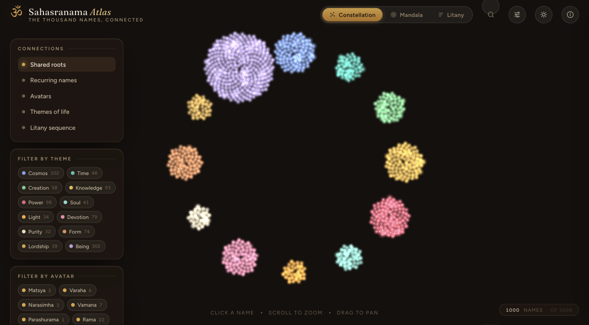
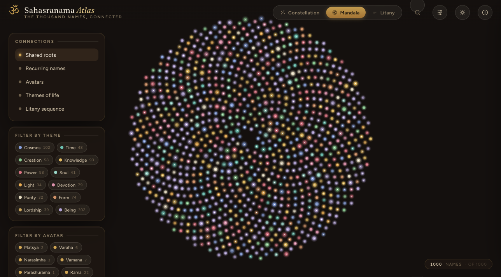
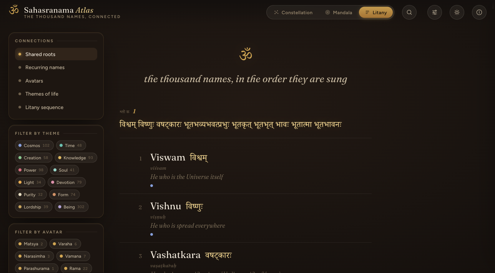
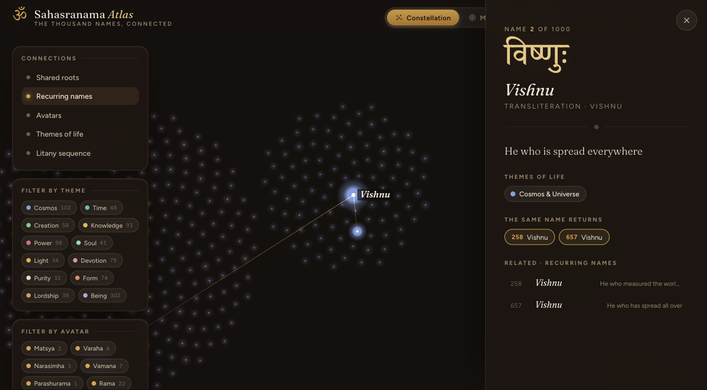

<div align="center">

# ॐ Sahasranama Atlas

### the thousand names of Viṣṇu, connected

An interactive atlas of the **1000 names** from the **Viṣṇu Sahasranāma**. Not a flat list, but
a living map you can wander. Names recur with new shades of meaning, cluster around shared roots,
gesture toward the avatāras, and together chart an entire inner life.

[**Open the live atlas**](https://sahasranama.github.io/)

[](https://sahasranama.github.io/)
[](https://sahasranama.github.io/)
[](#run-it-locally)
[](LICENSE)

<br>

<a href="https://sahasranama.github.io/"></a>

</div>

<br>

## Three lenses, one litany

The same thousand names, seen three ways. Switch between them from the top bar, and the layout
morphs smoothly between forms.

| | |
|---|---|
|  | **Constellation.** Names gather into **12 glowing theme-of-life clusters**: cosmos, time, knowledge, power, soul, grace, purity, lordship, being, and more. A galaxy of meaning. |
|  | **Mandala.** A **golden-angle spiral** in chanting order, with name 1 at the heart and name 1000 at the rim. The litany as a seed-head of light. |
|  | **Litany.** The full litany as an **illuminated, scrollable manuscript**, each name with its Devanāgarī, meaning, and theme. |

<br>

## One reality, many faces

The most striking thing hidden in the litany: **70 names recur** across the thousand, the same
name returning with a different meaning each time. Choose **Recurring names** in the Connections
panel and select a name to see gold threads drawn to its other lives.

<div align="center">

<br><em>Viṣṇu appears at 2, 258 and 657: "spread everywhere", "measured the worlds as Vāmana", "spread all over".</em>
</div>

<br>

## What's inside

- **Connections.** Draw gold threads from a name to its kin by shared roots, recurring names, avatars, themes, or litany sequence.
- **Detail panel.** Devanāgarī, meaning(s), theme and avatar tags, root etymologies, recurring twins, and clickable related names.
- **Filters and search.** Isolate a theme or avatar; search any name or meaning.
- **Atmosphere.** A day and night toggle, plus a Tweaks popover for motion, thread-accent colour, glow, and display typeface.
- **Made to feel sacred.** An ॐ loading state, breathing glow, golden threads, and a clay-and-gold palette.

<br>

## Run it locally

A **zero-build static site**, no bundler and no framework. Any static server works:

```bash
git clone https://github.com/sahasranama/sahasranama.github.io
cd sahasranama.github.io
python3 -m http.server 8731
# open http://localhost:8731/
```

```
index.html            chrome: top bar, rail, detail, about
css/atlas.css          design system (night and day themes)
js/engine.js           canvas renderer: layouts, morph, glow, threads
js/app.js              app state, lenses, detail panel, search
js/tweaks.js           the Tweaks popover
data/atlas.json        the 1000 names plus computed themes, roots, avatars, recurrences
data/names_1000.json   the name and meaning source
```

<br>

## Data and honesty

The names and meanings are the project's own dataset of **1000 entries** (an English translation
following the Sri Ramakrishna Mutt and Anna rendering). Two things are computed, not authoritative,
and easy to upgrade:

- **Devanāgarī** is hand-curated for **108 well-known names** and marked "pending verification"
  elsewhere. Drop in a verified Devanāgarī and IAST column and it populates automatically.
- **Themes, roots, avatar references and recurrences** are derived from the meaning text (the
  source is only name and meaning). Swap in an authoritative tagging and the atlas follows.

> "It is also very important to meditate on the meaning of each word while it is sung."

<br>

## License

Source code is **MIT** (see [LICENSE](LICENSE)). The translated names and meanings belong to their
respective authors and are included for educational and devotional use.

<div align="center"><br>ॐ नमो भगवते वासुदेवाय<br><sub>built with care at <a href="https://sahasranama.github.io/">sahasranama.github.io</a></sub></div>
